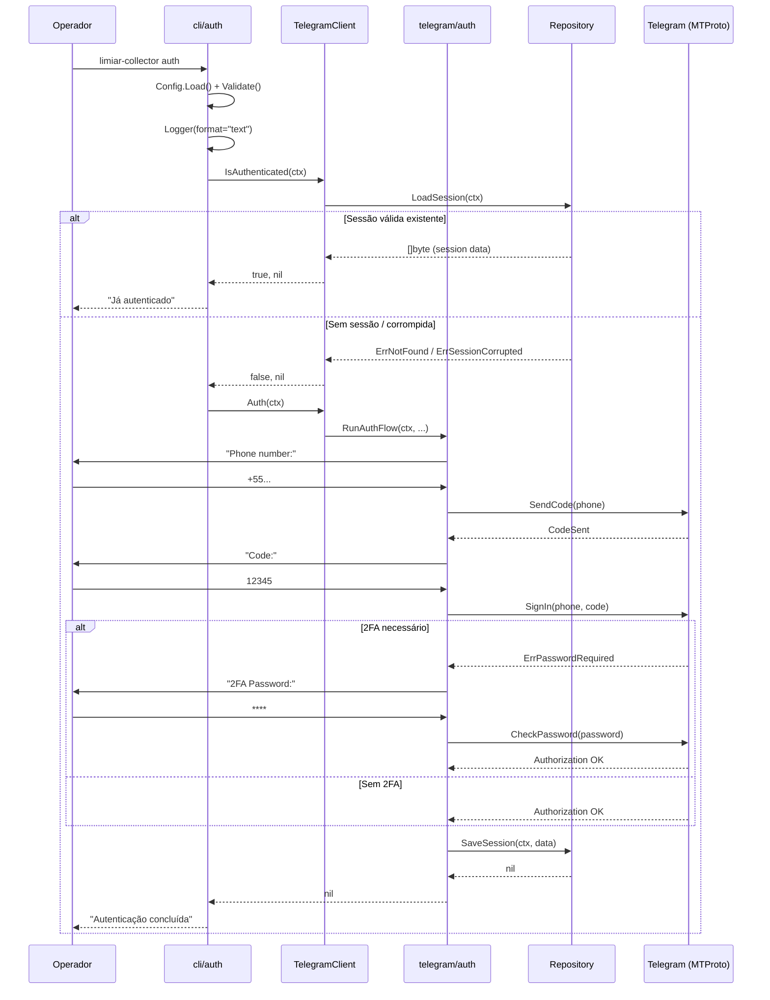
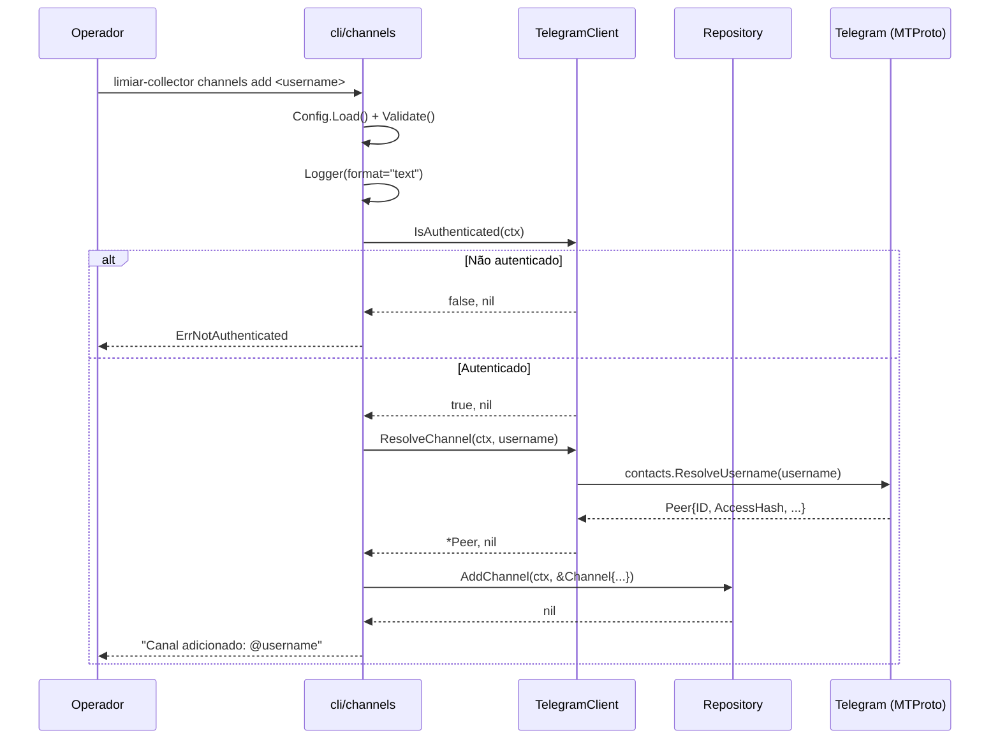
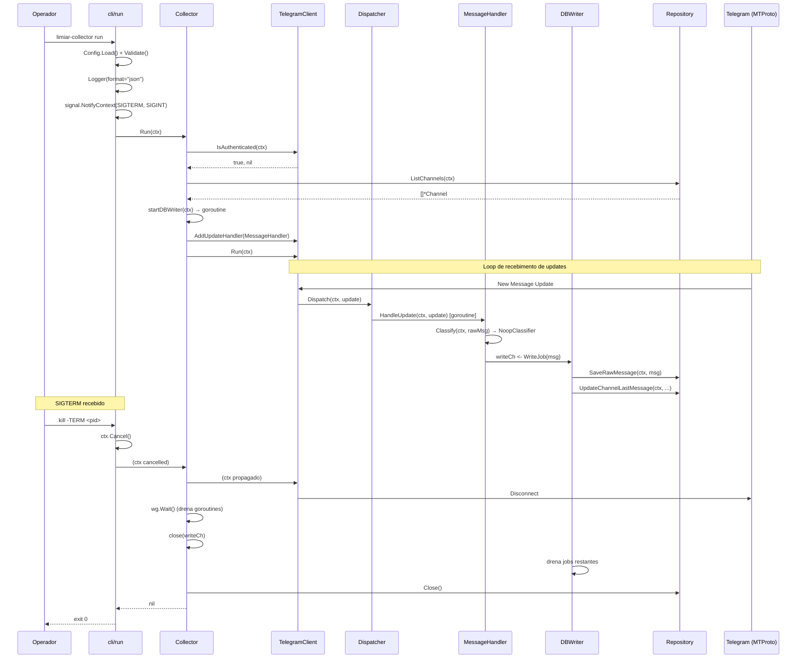

# Documento de Design — limiar-collector (Fase 1)

## Overview

O `limiar-collector` é um binário Go standalone que atua como primeiro estágio do pipeline Limiar. Conecta-se ao Telegram via MTProto (gotd/td), monitora canais configurados e persiste payloads brutos de mensagens em banco embarcado Tursogo.

A arquitetura segue quatro design patterns prescritos — Facade, Observer, Strategy e Adapter — com injeção manual de dependências orquestrada exclusivamente em `cmd/limiar-collector/main.go`. O modelo de concorrência utiliza goroutines por canal, fan-in para serialização de escritas e shutdown gracioso via propagação de contexto.

### Princípios de Design

- **Responsabilidade única**: cada pacote tem escopo estreito e não circular
- **Isolamento de dependências**: gotd/td visível apenas dentro de `internal/telegram/`
- **Concorrência sem locks no hot path**: MessageHandler stateless, DBWriter serializa escritas
- **Fail-fast na configuração, resiliente em runtime**: Validate() antes de I/O; backoff + retry em operação
- **Observabilidade desde o início**: logging estruturado em todas as camadas

---

## Architecture

### Diagrama de Alto Nível

```
┌─────────────────────────────────────────────────────────────────────────┐
│                        cmd/limiar-collector/main.go                       │
│                     (Manual DI — constrói todas as dependências)          │
└───────────────────────────────────┬─────────────────────────────────────┘
                                    │
                ┌───────────────────┼───────────────────┐
                │                   │                   │
                ▼                   ▼                   ▼
        ┌──────────┐       ┌──────────────┐    ┌──────────────┐
        │ cli/auth │       │ cli/channels │    │   cli/run    │
        └────┬─────┘       └──────┬───────┘    └──────┬───────┘
             │                    │                    │
             └────────────────────┼────────────────────┘
                                  │
                                  ▼
┌─────────────────────────────────────────────────────────────────────────┐
│                          Collector Layer                                  │
│  ┌────────────────┐  ┌──────────────────┐  ┌─────────────────────────┐  │
│  │   Collector     │  │  MessageHandler  │  │  Classifier (Strategy)  │  │
│  │  (orchestrator) │  │    (Adapter)     │  │   → NoopClassifier      │  │
│  └───────┬────────┘  └────────┬─────────┘  └─────────────────────────┘  │
│          │                    │                                           │
└──────────┼────────────────────┼──────────────────────────────────────────┘
           │                    │
           ▼                    ▼
┌─────────────────────────────────────────────────────────────────────────┐
│                          Telegram Layer (Facade)                          │
│  ┌──────────────────┐  ┌────────────┐  ┌────────────┐  ┌────────────┐  │
│  │ TelegramClient   │  │ Dispatcher │  │  PeerStore │  │  Session   │  │
│  │   (interface)    │  │ (Observer) │  │ (RWMutex)  │  │  Storage   │  │
│  └──────────────────┘  └────────────┘  └────────────┘  └────────────┘  │
│                              │                                            │
│                    ┌─────────┴─────────┐                                  │
│                    │  gotd/td (MTProto) │  ← ÚNICO ponto de contato       │
│                    └───────────────────┘                                  │
└─────────────────────────────────────────────────────────────────────────┘
           │
           ▼
┌─────────────────────────────────────────────────────────────────────────┐
│                          Storage Layer                                    │
│  ┌─────────────┐  ┌──────────────┐  ┌────────────────┐                  │
│  │   db.go     │  │ migrations   │  │  Repository    │                  │
│  │ (open/close)│  │  (embed.FS)  │  │ (all queries)  │                  │
│  └──────┬──────┘  └──────────────┘  └────────┬───────┘                  │
│         │                                     │                          │
│         └──────────────┬──────────────────────┘                          │
│                        ▼                                                  │
│              ┌─────────────────┐                                         │
│              │  Tursogo (turso)│  ← database/sql driver                  │
│              │   ./limiar.db   │                                         │
│              └─────────────────┘                                         │
└─────────────────────────────────────────────────────────────────────────┘
           │
           ▼
┌─────────────────────────────────────────────────────────────────────────┐
│                      Infraestrutura Transversal                           │
│  ┌────────────┐  ┌────────────┐  ┌────────────┐                         │
│  │   Config   │  │   Logger   │  │   Errors   │                         │
│  │(Viper/env) │  │ (slog wrap)│  │(sentinelas)│                         │
│  └────────────┘  └────────────┘  └────────────┘                         │
└─────────────────────────────────────────────────────────────────────────┘
```

### Diagrama de Concorrência — Fan-out / Fan-in

```
                    Telegram MTProto
                         │
                         ▼
                  ┌──────────────┐
                  │  Dispatcher  │
                  │  (Observer)  │
                  └──────┬───────┘
                         │ fan-out (goroutine por handler)
           ┌─────────────┼─────────────┐
           ▼             ▼             ▼
   ┌──────────────┐ ┌──────────────┐ ┌──────────────┐
   │ Channel #1   │ │ Channel #2   │ │ Channel #N   │
   │ goroutine    │ │ goroutine    │ │ goroutine    │
   │              │ │              │ │              │
   │ UpdateHandler│ │ UpdateHandler│ │ UpdateHandler│
   │ → Classify   │ │ → Classify   │ │ → Classify   │
   │ → WriteJob   │ │ → WriteJob   │ │ → WriteJob   │
   └──────┬───────┘ └──────┬───────┘ └──────┬───────┘
          │                 │                 │
          │    fan-in: chan WriteJob           │
          └────────────────►┌◄────────────────┘
                            │
                            ▼
                   ┌─────────────────┐
                   │    DBWriter     │
                   │ (single gorout.)│
                   │                 │
                   │ for job := range│
                   │   writeCh {     │
                   │   repo.Save()   │
                   │ }               │
                   └────────┬────────┘
                            │
                            ▼
                   ┌─────────────────┐
                   │   Tursogo DB    │
                   │  (serialized    │
                   │   writes)       │
                   └─────────────────┘
```

### Ordem de Build (Grafo de Dependências)

```
errors ─────────────────────────────────────────────────────────┐
config ─────────────────────────────────────────────────────────┤
logger (depende de: config) ────────────────────────────────────┤
storage (depende de: config, logger, errors) ───────────────────┤
telegram/session (depende de: storage, logger, errors) ─────────┤
telegram/peers (depende de: storage, logger) ───────────────────┤
telegram/auth (depende de: logger, errors) ─────────────────────┤
telegram/dispatcher (depende de: logger) ───────────────────────┤
telegram/client (depende de: config, session, peers, auth,      │
                             dispatcher, logger, errors) ────────┤
collector/classifier ───────────────────────────────────────────┤
collector/handler (depende de: classifier, storage, logger) ────┤
collector/collector (depende de: telegram/client, handler,       │
                                storage, logger, config) ────────┤
cli/root (depende de: config, logger, storage) ─────────────────┤
cli/auth (depende de: telegram/client, logger) ─────────────────┤
cli/channels (depende de: telegram/client, storage, logger) ────┤
cli/run (depende de: collector, logger, config) ────────────────┤
cmd/limiar-collector/main.go (depende de: TUDO acima) ──────────┘
```

---

## Components and Interfaces

### 1. `internal/errors/errors.go` — Domínio de Erros

```go
package errors

import "errors"

// Sentinel errors
var (
    ErrNotAuthenticated   = errors.New("not authenticated")
    ErrChannelNotFound    = errors.New("channel not found")
    ErrSessionCorrupted   = errors.New("session corrupted")
    ErrDBWriteFailed      = errors.New("database write failed")
    ErrMaxRetriesExceeded = errors.New("max retries exceeded")
)

// Wrap envolve um erro com contexto de camada.
// Formato: "layer: operation: original error"
func Wrap(layer, op string, err error) error {
    return fmt.Errorf("%s: %s: %w", layer, op, err)
}
```

### 2. `internal/config/config.go` — Configuração

```go
package config

import (
    "fmt"
    "strings"
    "time"

    "github.com/spf13/viper"
)

// Config armazena todas as configurações do limiar-collector.
type Config struct {
    AppID               int    `mapstructure:"app_id"`
    APIHash             string `mapstructure:"api_hash"`
    DBPath              string `mapstructure:"db_path"`
    LogLevel            string `mapstructure:"log_level"`
    LogFormat           string `mapstructure:"log_format"`
    ShutdownTimeout     int    `mapstructure:"shutdown_timeout"`
    MaxRetries          int    `mapstructure:"max_retries"`
    IOTimeout           time.Duration `mapstructure:"io_timeout"`
    DispatcherBufferSize int   `mapstructure:"dispatcher_buffer_size"`
    DBWriterBufferSize  int    `mapstructure:"db_writer_buffer_size"`
}

// Load lê configuração de variáveis de ambiente com prefixo LIMIAR_.
// Aplica valores padrão mas NÃO valida.
func Load(v *viper.Viper) (*Config, error)

// Validate verifica TODOS os campos e retorna erro agregado.
// Deve ser chamado explicitamente antes de qualquer I/O.
func (c *Config) Validate() error

// String implementa fmt.Stringer com mascaramento de APIHash.
func (c *Config) String() string
```

**Valores padrão:**

| Campo | Padrão | Range válido |
|-------|--------|--------------|
| `DBPath` | `./limiar.db` | qualquer path válido |
| `LogLevel` | `info` | `debug`, `info`, `warn`, `error` |
| `LogFormat` | `json` | `json`, `text` |
| `ShutdownTimeout` | `15` | 1–300 (segundos) |
| `MaxRetries` | `10` | 1–100 |
| `IOTimeout` | `30s` | 1–300 (segundos) |
| `DispatcherBufferSize` | `256` | 64–4096 |
| `DBWriterBufferSize` | `512` | 128–8192 |

### 3. `internal/logger/` — Logger

```go
// internal/logger/logger.go
package logger

// Logger define a interface de logging injetada em todas as camadas.
type Logger interface {
    Debug(msg string, args ...any)
    Info(msg string, args ...any)
    Warn(msg string, args ...any)
    Error(msg string, args ...any)
    With(args ...any) Logger
}
```

```go
// internal/logger/slog.go
package logger

import (
    "io"
    "log/slog"
)

// SlogLogger implementa Logger encapsulando slog.Logger.
// Esta é a ÚNICA localização onde slog é instanciado.
type SlogLogger struct {
    inner *slog.Logger
}

// NewSlogLogger cria um logger com o nível e formato especificados.
// format="json" → slog.NewJSONHandler
// format="text" → slog.NewTextHandler
// O handler filtra APIHash e dados de sessão de todos os atributos.
func NewSlogLogger(w io.Writer, level slog.Level, format string) *SlogLogger

func (l *SlogLogger) Debug(msg string, args ...any)
func (l *SlogLogger) Info(msg string, args ...any)
func (l *SlogLogger) Warn(msg string, args ...any)
func (l *SlogLogger) Error(msg string, args ...any)
func (l *SlogLogger) With(args ...any) Logger
```

### 4. `internal/storage/` — Camada de Armazenamento

```go
// internal/storage/db.go
package storage

import (
    "context"
    "database/sql"
    "embed"

    _ "turso.tech/database/tursogo"
)

// DB encapsula a conexão database/sql com driver tursogo.
type DB struct {
    conn *sql.DB
}

// Open abre o banco Tursogo no path especificado e executa migrations.
func Open(ctx context.Context, dbPath string) (*DB, error)

// Close fecha a conexão com o banco de dados.
func (db *DB) Close() error

// Conn retorna a conexão *sql.DB subjacente (somente para DBWriter).
func (db *DB) Conn() *sql.DB
```

```go
// internal/storage/migrations.go
package storage

import "embed"

//go:embed migrations/*.sql
var migrationsFS embed.FS

// Migrate executa todas as migrações pendentes.
func Migrate(ctx context.Context, db *sql.DB) error
```

```go
// internal/storage/repository.go
package storage

import (
    "context"
    "database/sql"
    "time"
)

// Repository centraliza TODAS as queries SQL.
// Usa prepared statements para queries recorrentes.
// Placeholder: apenas `?`
type Repository struct {
    db          *sql.DB
    stmtSaveMsg *sql.Stmt
    stmtSavePeer *sql.Stmt
    // ... demais prepared statements
}

// NewRepository cria o repository e prepara os statements.
func NewRepository(db *sql.DB) (*Repository, error)

// Close fecha todos os prepared statements.
func (r *Repository) Close() error

// --- Session ---
func (r *Repository) SaveSession(ctx context.Context, data []byte) error
func (r *Repository) LoadSession(ctx context.Context) ([]byte, error)

// --- Peers ---
func (r *Repository) SavePeer(ctx context.Context, p *Peer) error
func (r *Repository) LoadPeers(ctx context.Context) ([]*Peer, error)

// --- Channels ---
func (r *Repository) AddChannel(ctx context.Context, ch *Channel) error
func (r *Repository) RemoveChannel(ctx context.Context, username string) error
func (r *Repository) ListChannels(ctx context.Context) ([]*Channel, error)
func (r *Repository) GetChannel(ctx context.Context, id int64) (*Channel, error)
func (r *Repository) UpdateChannelLastMessage(ctx context.Context, channelID, messageID int64, collectedAt time.Time) error

// --- Raw Messages ---
func (r *Repository) SaveRawMessage(ctx context.Context, msg *RawMessage) error
func (r *Repository) CountRawMessages(ctx context.Context) (int64, error)
```

### 5. `internal/telegram/` — Camada Telegram (Facade)

```go
// internal/telegram/session.go
package telegram

import (
    "context"

    "github.com/gotd/td/session"
)

// TursoSessionStorage implementa session.Storage do gotd/td,
// persistindo a sessão via Repository/Tursogo.
type TursoSessionStorage struct {
    repo   *storage.Repository
    logger logger.Logger
}

// Satisfaz a interface session.Storage do gotd/td:
//   LoadSession(ctx context.Context) ([]byte, error)
//   StoreSession(ctx context.Context, data []byte) error
func NewTursoSessionStorage(repo *storage.Repository, log logger.Logger) *TursoSessionStorage
func (s *TursoSessionStorage) LoadSession(ctx context.Context) ([]byte, error)
func (s *TursoSessionStorage) StoreSession(ctx context.Context, data []byte) error
```

```go
// internal/telegram/peers.go
package telegram

import (
    "context"
    "sync"
)

// PeerStore mantém cache in-memory de peers protegido por RWMutex.
type PeerStore struct {
    mu    sync.RWMutex
    peers map[int64]*Peer
    repo  *storage.Repository
    log   logger.Logger
}

func NewPeerStore(repo *storage.Repository, log logger.Logger) *PeerStore
func (ps *PeerStore) Get(id int64) (*Peer, bool)
func (ps *PeerStore) Set(p *Peer)
func (ps *PeerStore) LoadFromDB(ctx context.Context) error
func (ps *PeerStore) FlushToDB(ctx context.Context) error
```

```go
// internal/telegram/auth.go
package telegram

import (
    "context"
)

// RunAuthFlow executa o fluxo interativo: phone → code → 2FA (opcional).
// Lê de stdin via bufio.Scanner.
// Retorna ErrPasswordRequired se 2FA for necessário e solicita a senha.
func RunAuthFlow(ctx context.Context, client interface{}, log logger.Logger) error
```

```go
// internal/telegram/dispatcher.go
package telegram

import "context"

// UpdateHandler é a interface Observer para receber atualizações.
type UpdateHandler interface {
    HandleUpdate(ctx context.Context, update []byte) error
}

// Dispatcher distribui atualizações para handlers registrados.
// Cada handler é invocado em goroutine separada via canal bufferizado.
// recover() nos limites de goroutines do dispatcher.
type Dispatcher struct {
    handlers   []UpdateHandler
    bufferSize int
    log        logger.Logger
    wg         sync.WaitGroup
}

func NewDispatcher(bufferSize int, log logger.Logger) *Dispatcher
func (d *Dispatcher) Register(h UpdateHandler)
func (d *Dispatcher) Dispatch(ctx context.Context, update []byte)
func (d *Dispatcher) Shutdown(ctx context.Context) error
```

```go
// internal/telegram/client.go
package telegram

import "context"

// TelegramClient é a Facade que esconde TODA a complexidade do gotd/td.
// Nenhum tipo gotd/td é exposto nesta interface.
type TelegramClient interface {
    // Connect estabelece conexão MTProto com retry/backoff.
    Connect(ctx context.Context) error

    // Auth executa o fluxo de autenticação (phone → code → 2FA).
    Auth(ctx context.Context) error

    // IsAuthenticated verifica se existe sessão válida persistida.
    IsAuthenticated(ctx context.Context) (bool, error)

    // AddUpdateHandler registra um handler no Dispatcher.
    AddUpdateHandler(h UpdateHandler)

    // ResolveChannel resolve username → Peer com access_hash.
    ResolveChannel(ctx context.Context, username string) (*Peer, error)

    // Run inicia o loop de recebimento de updates.
    // Bloqueia até ctx ser cancelado.
    Run(ctx context.Context) error
}

// Client implementa TelegramClient sobre gotd/td.
// É a ÚNICA struct que importa tipos gotd/td.
type Client struct {
    cfg        *config.Config
    session    *TursoSessionStorage
    peers      *PeerStore
    dispatcher *Dispatcher
    log        logger.Logger
    // campos internos gotd/td (não expostos)
}

func NewClient(
    cfg *config.Config,
    session *TursoSessionStorage,
    peers *PeerStore,
    dispatcher *Dispatcher,
    log logger.Logger,
) *Client
```

### 6. `internal/collector/` — Camada Collector

```go
// internal/collector/classifier.go
package collector

// Classifier é a interface Strategy para classificação de mensagens.
// Plugável desde o início; Fase 1 usa NoopClassifier.
type Classifier interface {
    Classify(ctx context.Context, msg *RawMessage) (*RawMessage, error)
}

// NoopClassifier retorna a mensagem sem modificação (Fase 1).
type NoopClassifier struct{}

func (n *NoopClassifier) Classify(_ context.Context, msg *RawMessage) (*RawMessage, error) {
    return msg, nil
}
```

```go
// internal/collector/handler.go
package collector

import "context"

// MessageHandler implementa telegram.UpdateHandler.
// Adapter: converte update bruto gotd/td → RawMessage.
// É stateless e seguro para invocação concorrente sem locks.
type MessageHandler struct {
    classifier Classifier
    writeCh    chan<- WriteJob
    log        logger.Logger
}

// WriteJob representa um trabalho de escrita para o DBWriter.
type WriteJob struct {
    Message *RawMessage
    ErrCh   chan<- error // opcional: para notificação de falha
}

func NewMessageHandler(
    classifier Classifier,
    writeCh chan<- WriteJob,
    log logger.Logger,
) *MessageHandler

// HandleUpdate adapta o update bruto em RawMessage e envia ao DBWriter.
// Implementa telegram.UpdateHandler.
func (h *MessageHandler) HandleUpdate(ctx context.Context, update []byte) error
```

```go
// internal/collector/collector.go
package collector

import (
    "context"
    "sync"
)

// Collector orquestra o monitoramento de canais.
// Gerencia goroutines per-channel e o DBWriter.
type Collector struct {
    client     telegram.TelegramClient
    repo       *storage.Repository
    classifier Classifier
    log        logger.Logger
    cfg        *config.Config
    writeCh    chan WriteJob
    wg         sync.WaitGroup
}

func NewCollector(
    client telegram.TelegramClient,
    repo *storage.Repository,
    classifier Classifier,
    log logger.Logger,
    cfg *config.Config,
) *Collector

// Run inicia o collector:
// 1. Verifica autenticação
// 2. Carrega canais ativos
// 3. Inicia DBWriter goroutine
// 4. Registra MessageHandler no client
// 5. Inicia client.Run(ctx) — bloqueia até ctx cancelado
// 6. Drena WaitGroup no shutdown
func (c *Collector) Run(ctx context.Context) error

// startDBWriter inicia a goroutine única de escrita.
func (c *Collector) startDBWriter(ctx context.Context)

// drainAndClose espera WaitGroup e fecha recursos.
func (c *Collector) drainAndClose(ctx context.Context) error
```

### 7. `internal/cli/` — Camada CLI

```go
// internal/cli/root.go
package cli

import "github.com/spf13/cobra"

// Deps contém dependências resolvidas pelo root command.
// Passado via context ou closure para subcomandos.
type Deps struct {
    Config *config.Config
    Logger logger.Logger
    DB     *storage.DB
    Repo   *storage.Repository
}

// NewRootCmd cria o comando raiz Cobra.
// PersistentPreRunE: Load() config via Viper, Validate(), instancia Logger, abre DB.
func NewRootCmd() *cobra.Command
```

```go
// internal/cli/auth.go
package cli

import "github.com/spf13/cobra"

// NewAuthCmd cria o subcomando `auth`.
// Logger: formato texto.
// Fluxo: verifica sessão existente → se válida, informa e sai;
//        caso contrário executa RunAuthFlow.
func NewAuthCmd(deps *Deps) *cobra.Command
```

```go
// internal/cli/channels.go
package cli

import "github.com/spf13/cobra"

// NewChannelsCmd cria o subcomando `channels` com sub-subcomandos:
//   - list: exibe todos os canais
//   - add <username>: adiciona canal (resolve via TelegramClient)
//   - remove <username>: remove canal
// Logger: formato texto.
// Precondição: sessão válida (retorna ErrNotAuthenticated se ausente).
func NewChannelsCmd(deps *Deps) *cobra.Command
```

```go
// internal/cli/run.go
package cli

import "github.com/spf13/cobra"

// NewRunCmd cria o subcomando `run`.
// Logger: formato JSON.
// Precondição: sessão válida.
// Usa signal.NotifyContext(ctx, SIGTERM, SIGINT) para shutdown gracioso.
// Aguarda ShutdownTimeout antes de forçar encerramento.
func NewRunCmd(deps *Deps) *cobra.Command
```

### 8. `cmd/limiar-collector/main.go` — Entrypoint

```go
package main

import (
    "os"

    "github.com/limiar/collector/internal/cli"
)

func main() {
    rootCmd := cli.NewRootCmd()
    if err := rootCmd.Execute(); err != nil {
        os.Exit(1)
    }
}
```

---

## Data Models

### Modelos Internos

```go
// RawMessage representa um payload de mensagem Telegram capturado.
type RawMessage struct {
    ID            int64     // AUTOINCREMENT
    ChannelID     int64     // FK → channels.id
    MessageID     int64     // ID da mensagem no Telegram
    Payload       []byte    // JSON bruto do update gotd/td
    ReceivedAt    time.Time // Momento da captura
    SchemaVersion int       // Versão do schema do payload (1 para Fase 1)
}

// Channel representa um canal Telegram monitorado.
type Channel struct {
    ID              int64
    Username        string
    Title           string
    Active          bool
    AddedAt         time.Time
    LastMessageID   int64
    LastCollectedAt time.Time
}

// Peer representa um peer Telegram (canal, usuário, chat).
type Peer struct {
    ID         int64
    AccessHash int64
    Type       string    // "channel", "user", "chat"
    Username   string
    UpdatedAt  time.Time
}
```

### Schema SQL (`migrations/001_initial.sql`)

```sql
-- migrations/001_initial.sql
-- Schema inicial do limiar-collector (Fase 1)

CREATE TABLE IF NOT EXISTS sessions (
    id         INTEGER PRIMARY KEY DEFAULT 1,
    data       BLOB NOT NULL,
    updated_at TEXT NOT NULL DEFAULT (datetime('now')),
    CHECK (id = 1)  -- garante sessão única
);

CREATE TABLE IF NOT EXISTS peers (
    id          INTEGER PRIMARY KEY,
    access_hash INTEGER NOT NULL,
    type        TEXT NOT NULL CHECK (type IN ('channel', 'user', 'chat')),
    username    TEXT,
    updated_at  TEXT NOT NULL DEFAULT (datetime('now'))
);

CREATE TABLE IF NOT EXISTS channels (
    id                INTEGER PRIMARY KEY,
    username          TEXT NOT NULL UNIQUE,
    title             TEXT NOT NULL DEFAULT '',
    active            INTEGER NOT NULL DEFAULT 1,
    added_at          TEXT NOT NULL DEFAULT (datetime('now')),
    last_message_id   INTEGER NOT NULL DEFAULT 0,
    last_collected_at TEXT
);

CREATE TABLE IF NOT EXISTS raw_messages (
    id             INTEGER PRIMARY KEY AUTOINCREMENT,
    channel_id     INTEGER NOT NULL REFERENCES channels(id),
    message_id     INTEGER NOT NULL,
    payload        TEXT NOT NULL,  -- JSON
    received_at    TEXT NOT NULL DEFAULT (datetime('now')),
    schema_version INTEGER NOT NULL DEFAULT 1,
    UNIQUE(channel_id, message_id)  -- impede duplicatas por canal
);

CREATE INDEX IF NOT EXISTS idx_raw_messages_channel
    ON raw_messages(channel_id, message_id);

CREATE INDEX IF NOT EXISTS idx_channels_username
    ON channels(username);
```

---

## Fluxos — Diagramas de Sequência

### Fluxo de Autenticação (`auth`)



### Fluxo de Canais (`channels`)



### Fluxo de Execução (`run`)



---

## Algoritmos

### Backoff Exponencial com Jitter

```
Algoritmo: ExponentialBackoffWithJitter
Entradas:
  - attempt: int (número da tentativa, começando em 0)
  - baseDelay: Duration = 1s
  - multiplier: float64 = 2.0
  - jitterPercent: float64 = 0.10
  - ceiling: Duration = 5min
  - maxRetries: int (configurável)
Saída:
  - delay: Duration (ou ErrMaxRetriesExceeded)

Pseudocódigo:
  IF attempt >= maxRetries THEN
    RETURN 0, ErrMaxRetriesExceeded
  END IF

  // Cálculo do delay base exponencial
  delay = baseDelay * (multiplier ^ attempt)

  // Aplica ceiling
  IF delay > ceiling THEN
    delay = ceiling
  END IF

  // Aplica jitter: ±jitterPercent
  jitter = delay * jitterPercent
  delay = delay + random(-jitter, +jitter)

  // Garante delay mínimo de 0
  IF delay < 0 THEN
    delay = 0
  END IF

  RETURN delay, nil
```

```go
// Implementação em Go
func CalculateBackoff(attempt int, cfg BackoffConfig) (time.Duration, error) {
    if attempt >= cfg.MaxRetries {
        return 0, ErrMaxRetriesExceeded
    }
    delay := float64(cfg.BaseDelay) * math.Pow(cfg.Multiplier, float64(attempt))
    if delay > float64(cfg.Ceiling) {
        delay = float64(cfg.Ceiling)
    }
    jitter := delay * cfg.JitterPercent
    delay += (rand.Float64()*2 - 1) * jitter
    if delay < 0 {
        delay = 0
    }
    return time.Duration(delay), nil
}

type BackoffConfig struct {
    BaseDelay     time.Duration // 1s
    Multiplier    float64       // 2.0
    JitterPercent float64       // 0.10
    Ceiling       time.Duration // 5min
    MaxRetries    int           // configurável
}
```

### Retry com Backoff (Template)

```
Algoritmo: RetryWithBackoff
Entradas:
  - ctx: context.Context
  - operation: func() error
  - cfg: BackoffConfig
Saída:
  - error (nil se sucesso, último erro se maxRetries excedido)

Pseudocódigo:
  FOR attempt = 0; attempt < cfg.MaxRetries; attempt++ DO
    err = operation()
    IF err == nil THEN
      RETURN nil
    END IF

    IF ctx.Done() THEN
      RETURN ctx.Err()
    END IF

    delay, backoffErr = CalculateBackoff(attempt, cfg)
    IF backoffErr != nil THEN
      RETURN Wrap("retry", "max_retries", err)
    END IF

    Sleep(ctx, delay)  // respects context cancellation
  END FOR

  RETURN Wrap("retry", "exhausted", lastErr)
```

### Flood Wait Handler

```
Algoritmo: HandleFloodWait
Entradas:
  - ctx: context.Context
  - err: error (contém duração do flood_wait)
Saída:
  - error

Pseudocódigo:
  duration = ExtractFloodWaitDuration(err)
  log.Warn("flood_wait", "duration", duration)

  SELECT:
    CASE <-time.After(duration):
      RETURN nil  // pronto para retry
    CASE <-ctx.Done():
      RETURN ctx.Err()
  END SELECT
```

### DBWriter Loop

```
Algoritmo: DBWriterLoop
Entradas:
  - ctx: context.Context
  - writeCh: <-chan WriteJob
  - repo: *Repository
  - cfg: BackoffConfig (para retries de escrita)
Saída: (roda como goroutine, encerra quando writeCh é fechado)

Pseudocódigo:
  FOR job := range writeCh DO
    err = RetryWithBackoff(ctx, func() error {
      RETURN repo.SaveRawMessage(ctx, job.Message)
    }, cfg)

    IF err != nil THEN
      log.Error("db_write_failed",
        "channel_id", job.Message.ChannelID,
        "message_id", job.Message.MessageID,
        "error", err)
      // Notifica se canal de erro disponível
      IF job.ErrCh != nil THEN
        job.ErrCh <- Wrap("dbwriter", "save", ErrDBWriteFailed)
      END IF
    ELSE
      // Atualiza metadata do canal
      repo.UpdateChannelLastMessage(ctx,
        job.Message.ChannelID,
        job.Message.MessageID,
        job.Message.ReceivedAt)
    END IF
  END FOR
```

---

## Error Handling

### Estratégia por Camada

| Camada | Erro | Ação |
|--------|------|------|
| Config | Campos inválidos | Agregar todos os erros, reportar antes de I/O |
| Storage | Falha de abertura | Fatal — log + exit |
| Storage | Falha de escrita | Retry via DBWriter; após MaxRetries → ErrDBWriteFailed |
| Telegram | Sessão corrompida | ErrSessionCorrupted — requer `auth` novamente |
| Telegram | Não autenticado | ErrNotAuthenticated — requer `auth` |
| Telegram | Conexão perdida | Backoff exponencial até MaxRetries |
| Telegram | Flood_Wait | Aguardar duração exata informada pelo servidor |
| Telegram | Canal não encontrado | ErrChannelNotFound |
| Collector | Falha de persistência | Log mensagem perdida, continua operando |
| Dispatcher | Panic em handler | recover() no limite da goroutine, log, continua |

### Formato de Wrapping

```
"<camada>: <operação>: <erro original>"
```

Exemplos:
- `"telegram: connect: connection refused"`
- `"storage: save_session: disk full"`
- `"collector: handle_update: channel_id=123: database write failed"`

### Propagação

```
gotd/td error
  → telegram/client.go: Wrap("telegram", "run", err)
    → collector/collector.go: Wrap("collector", "run", err)
      → cli/run.go: log + exit code
```

---

## Correctness Properties

*Uma propriedade é uma característica ou comportamento que deve ser verdadeiro em todas as execuções válidas de um sistema — essencialmente, uma declaração formal sobre o que o sistema deve fazer. Propriedades servem como ponte entre especificações legíveis por humanos e garantias de correção verificáveis por máquina.*

### Property 1: Session Storage Round-Trip

*For any* valid session byte slice, storing it via `SaveSession` and then loading via `LoadSession` should return an identical byte slice.

**Validates: Requirements 1.4**

### Property 2: Auth Idempotence

*For any* number of consecutive auth invocations when a valid session already exists, the session count in the database should remain exactly 1 (the `CHECK (id = 1)` constraint guarantees single-row).

**Validates: Requirements 1.5**

### Property 3: Corrupted Session Detection

*For any* random byte slice that is NOT a valid session encoding (as produced by gotd/td's `session.Loader.Save`), calling `LoadSession` and attempting to deserialize should yield an error satisfying `errors.Is(err, ErrSessionCorrupted)`.

**Validates: Requirements 1.6**

### Property 4: Channel CRUD Round-Trip

*For any* set of valid channel usernames added via `AddChannel`, calling `ListChannels` should return exactly that set with `Active=true`; and for any username subsequently removed via `RemoveChannel`, a subsequent `ListChannels` should not include it.

**Validates: Requirements 2.3, 2.4, 2.5**

### Property 5: RawMessage Payload Preservation

*For any* valid gotd/td update serialized to JSON, the `MessageHandler` adapter should produce a `RawMessage` whose `Payload` field, when persisted and loaded back from the database, is byte-for-byte identical to the original serialized JSON.

**Validates: Requirements 3.3, 3.4, 3.7**

### Property 6: NoopClassifier Identity

*For any* `RawMessage`, `NoopClassifier.Classify(ctx, msg)` should return a `RawMessage` that is deeply equal to the input.

**Validates: Requirements 3.8**

### Property 7: Channel Metadata Update on Persist

*For any* channel with a known `LastMessageID` and any new `RawMessage` with `MessageID > LastMessageID`, after persisting the message, the channel's `LastMessageID` should equal the new message's ID and `LastCollectedAt` should be updated.

**Validates: Requirements 3.5**

### Property 8: Backoff Delay Formula

*For any* attempt number N in [0, MaxRetries), the calculated backoff delay should satisfy: `|delay - min(baseDelay * multiplier^N, ceiling)| <= ceiling * jitterPercent`.

**Validates: Requirements 6.1**

### Property 9: Retry Termination

*For any* configured `MaxRetries` value and an operation that always fails, the retry loop should execute exactly `MaxRetries` attempts and then return an error satisfying `errors.Is(err, ErrDBWriteFailed)` (for DB) or stop reconnecting (for Telegram).

**Validates: Requirements 6.2, 6.4**

### Property 10: Flood Wait Exact Duration

*For any* flood_wait duration D signaled by Telegram, the actual wait time before the next retry should be within ±50ms of D (accounting for scheduling jitter).

**Validates: Requirements 6.3**

### Property 11: Config Validation Collects All Errors

*For any* combination of N missing or invalid required config fields (N >= 1), `Validate()` should return an error message containing references to all N invalid fields, not just the first.

**Validates: Requirements 7.4, 7.5**

### Property 12: Config Defaults Applied

*For any* `Config` loaded without specifying optional fields (`DBPath`, `LogLevel`, `LogFormat`, `ShutdownTimeout`), the resulting config should have the documented default values.

**Validates: Requirements 7.6**

### Property 13: Config Field Validation Rejects Invalid Values

*For any* `LogLevel` value NOT in `{debug, info, warn, error}`, or `LogFormat` NOT in `{json, text}`, or `ShutdownTimeout` outside [1, 300], or `DispatcherBufferSize` outside [64, 4096], or `DBWriterBufferSize` outside [128, 8192], `Validate()` should return a validation error.

**Validates: Requirements 7.7, 7.8**

### Property 14: Sensitive Data Masking

*For any* random `APIHash` string, neither `Config.String()` output nor any log entry produced by the Logger should contain that string verbatim.

**Validates: Requirements 7.9, 7.10**

### Property 15: Error Wrapping Preserves Sentinel Identity

*For any* sentinel error wrapped N levels deep via `Wrap(layer, op, sentinel)`, `errors.Is(wrappedErr, sentinel)` should return `true`.

**Validates: Requirements 8.2, 8.3**

### Property 16: Shutdown Within Timeout

*For any* valid `ShutdownTimeout` value T (1-300 seconds), when the root context is cancelled, the collector should complete shutdown within T seconds.

**Validates: Requirements 4.3**

---

## Testing Strategy

### Abordagem Dual

O projeto utiliza uma abordagem dual de testes:

1. **Testes unitários (example-based)**: Cenários específicos, edge cases, verificação de comportamento determinístico
2. **Testes de propriedade (property-based)**: Verificação de propriedades universais sobre todos os inputs válidos

### Biblioteca de Property-Based Testing

- **Biblioteca**: [`pgregory.net/rapid`](https://github.com/flyingmutant/rapid) (PBT idiomático para Go, integra com `testing.T`)
- **Mínimo de iterações**: 100 por propriedade
- **Tag**: `// Feature: limiar-collector, Property N: <texto da propriedade>`

> **Nota:** `pgregory.net/rapid` é a única dependência permitida fora do stack fechado. Seu uso é restrito exclusivamente a arquivos `_test.go`. Deve ser adicionado ao `go.mod` via `go get pgregory.net/rapid`.

### Organização de Testes

| Pacote | Tipo de Teste | Foco |
|--------|---------------|------|
| `internal/config` | Property + Unit | Validação, defaults, masking |
| `internal/storage` | Property + Unit | Round-trips, CRUD, migrations |
| `internal/telegram/session` | Property | Round-trip, corrupção |
| `internal/telegram/peers` | Unit + Race | Concorrência RWMutex |
| `internal/telegram/dispatcher` | Unit + Race | Fan-out, recover() |
| `internal/collector/classifier` | Property | Identidade NoopClassifier |
| `internal/collector/handler` | Property + Unit | Serialização, payload preservation |
| `internal/collector/collector` | Integration | Fluxo completo com mocks |
| `internal/errors` | Property | Wrapping preserva Is() |

### Mapeamento Propriedades → Testes

| Propriedade | Arquivo de Teste | Framework |
|-------------|-----------------|-----------|
| 1: Session Round-Trip | `internal/telegram/session_test.go` | rapid |
| 2: Auth Idempotence | `internal/telegram/session_test.go` | rapid |
| 3: Corrupted Session | `internal/telegram/session_test.go` | rapid |
| 4: Channel CRUD | `internal/storage/repository_test.go` | rapid |
| 5: Payload Preservation | `internal/collector/handler_test.go` | rapid |
| 6: NoopClassifier Identity | `internal/collector/classifier_test.go` | rapid |
| 7: Channel Metadata | `internal/storage/repository_test.go` | rapid |
| 8: Backoff Formula | `internal/telegram/client_test.go` | rapid |
| 9: Retry Termination | `internal/telegram/client_test.go` | rapid |
| 10: Flood Wait Duration | `internal/telegram/client_test.go` | rapid |
| 11: Config Validation All Errors | `internal/config/config_test.go` | rapid |
| 12: Config Defaults | `internal/config/config_test.go` | rapid |
| 13: Config Rejects Invalid | `internal/config/config_test.go` | rapid |
| 14: Sensitive Masking | `internal/config/config_test.go` | rapid |
| 15: Error Wrapping Is() | `internal/errors/errors_test.go` | rapid |
| 16: Shutdown Timeout | `internal/collector/collector_test.go` | unit (timer) |

### Testes de Integração

- Fluxo completo `auth → channels add → run → receive → persist → shutdown`
- Executados com banco Tursogo real (embedded, sem rede)
- Race detector habilitado: `go test -race ./...`

### Quality Gates

```bash
go build ./...          # compila sem erro
go vet ./...            # sem warnings
go test ./...           # todos os testes passam
go test -race ./...     # sem data races
```

---

## Riscos e Mitigações

| Risco | Probabilidade | Mitigação |
|-------|--------------|-----------|
| API `tursogo` diverge do `database/sql` padrão | Média | Usar apenas `Query`, `Exec`, `QueryRow` do `*sql.DB`; consultar docs antes de implementar `db.go` |
| `gotd/td` muda interface `SessionStorage` entre versões | Baixa | Fixar versão no `go.mod`; adaptar apenas em `session.go` |
| 2FA tem fluxo diferente por conta | Alta | Capturar `ErrPasswordRequired`, solicitar senha via stdin com fallback gracioso |
| Peer não encontrado ao resolver canal | Média | Erro descritivo: `fmt.Errorf("channels: resolve: peer not found for %q: %w", username, err)` |
| Race condition no dispatcher paralelo | Baixa | Handlers recebem cópia do update; channel com buffer; `sync.WaitGroup` no shutdown |
