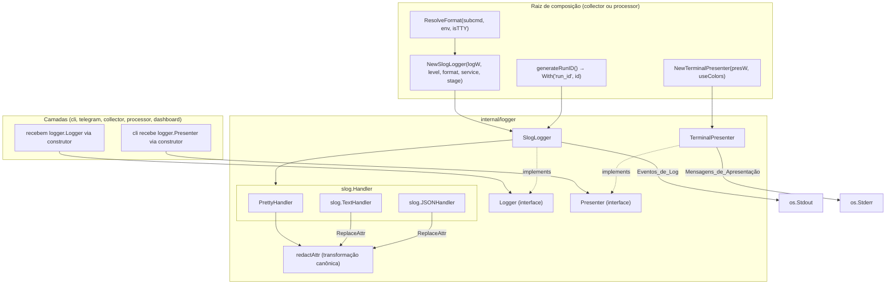
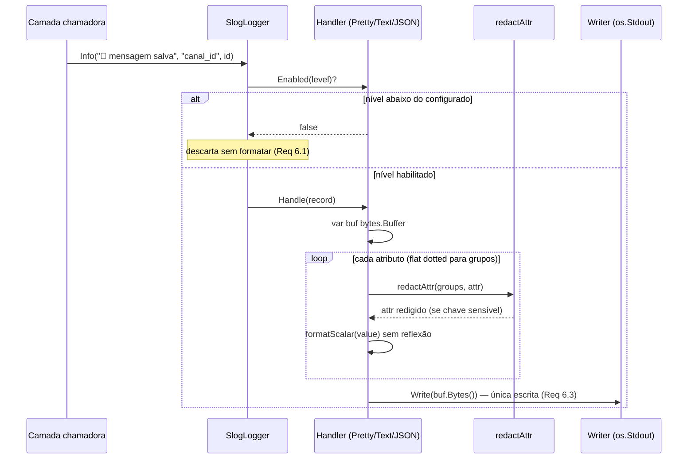
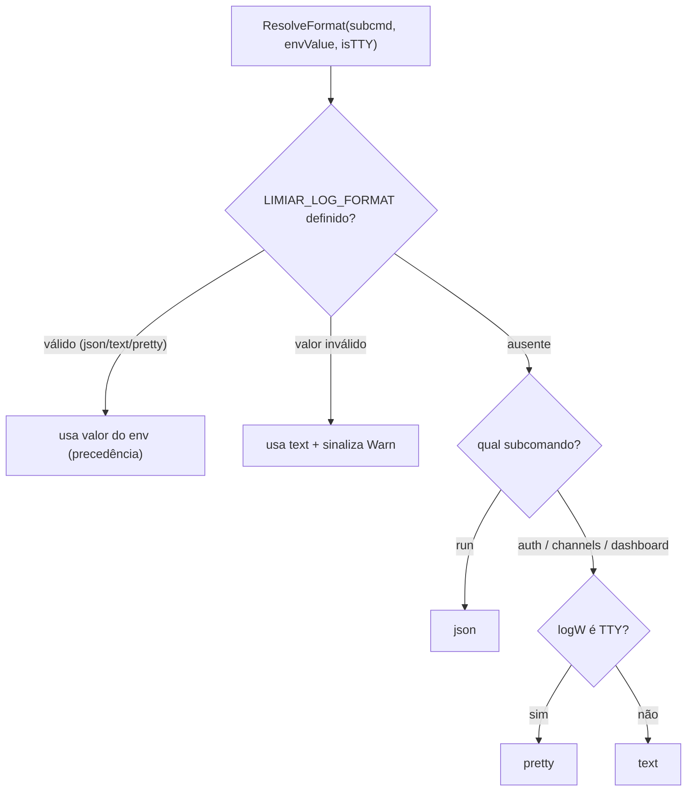
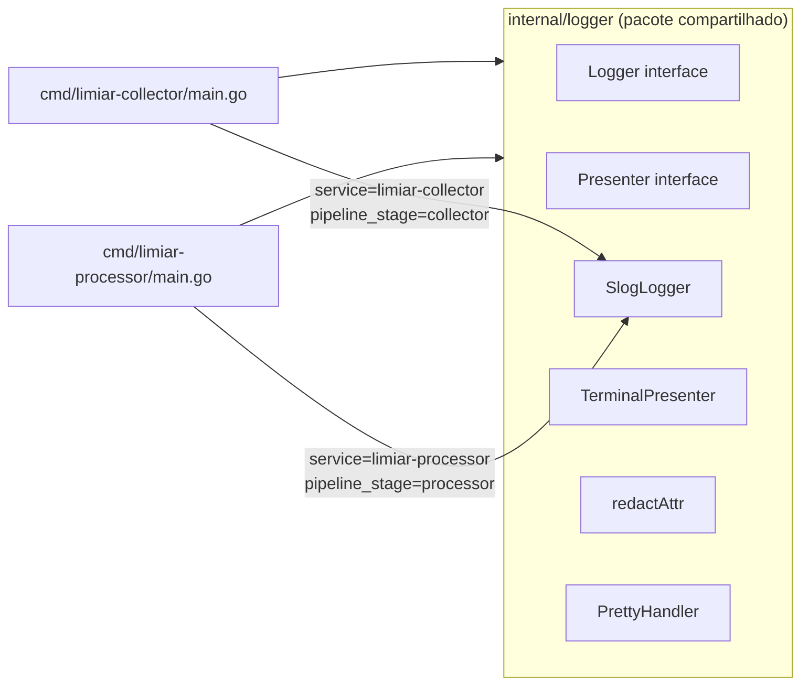

# Design Document

## Overview

Este documento descreve a **evolução profissional** do pacote `internal/logger` do ecossistema
Limiar, compartilhado pelo `limiar-collector` e pelo `limiar-processor`. O ponto de partida é o
código atual em produção (`logger.go`, `slog.go`, `pretty.go`, `nop.go`) e as raízes de composição
dos dois binários. O design preserva integralmente o contrato público (`logger.Logger`) e as
restrições rígidas do `AGENTS.md`, corrigindo as lacunas levantadas pela auditoria e pela Design
Review Crítica.

### Princípio orientador

> "Se uma pessoa lendo o código pela primeira vez não entender imediatamente por que algo existe,
> provavelmente não deveria existir."

O sistema de logging tem ~400 LoC hoje. O redesign deve chegar a ~600-700 LoC (incluindo o
Presenter e a redação corrigida). A complexidade adicional é estritamente proporcional ao problema
resolvido.

### Decisões da Design Review Crítica aplicadas

| # | Decisão da Review | Resultado neste design |
|---|-------------------|------------------------|
| R1 | Presenter como **interface** com impl concreta `TerminalPresenter` | Interface para DI e testabilidade; impl sem mutex |
| R2 | **Remover mutex** do Presenter | Cada método faz uma única `Write`; atomicidade natural de stderr |
| R3 | **run_id automático** na raiz de composição | Zero risco de esquecimento; toda execução correlacionada |
| R4 | **Dashboard = pretty quando TTY** (unificar com auth/channels) | Eliminada a exceção; todos os interativos seguem TTY detection |
| R5 | **Eliminar Theme como tipo separado** | Arrays de constantes internos no `TerminalPresenter` |
| R6 | **Remover sync.Pool** do PrettyHandler | Buffer local suficiente para ~50 eventos em subcomandos interativos |
| R7 | **Grupos em flat dotted notation** (`auth.api_hash`) | Sem rendering `{k=v}`; minimal, mesma lógica do TextHandler stdlib |
| R8 | **Remover variantes `*f`** do Presenter | API mínima; call-site usa `fmt.Sprintf` quando precisa |
| R9 | **Unificação collector/processor** | Pacote compartilhado, atributos padronizados, correlação cross-stage |

### Mapa requisito → componente

| Requisito | Componente principal |
|-----------|----------------------|
| 1 Redação em todos os formatos | `redactAttr`, `PrettyHandler.Handle`, `slog.HandlerOptions.ReplaceAttr` |
| 2 Apresentação × log | `Presenter` (interface), `TerminalPresenter` (impl), raiz de composição |
| 3 Prefixos/cores centralizados | `TerminalPresenter` (constantes internas) |
| 4 Hierarquia visual | `PrettyHandler` (alinhamento), `TerminalPresenter` (linha única) |
| 5 Observabilidade/correlação | `run_id` automático, `WithComponent`, `pipeline_stage`, `service` |
| 6 Performance | `PrettyHandler` (escrita única, formatação sem reflexão), benchmark |
| 7 Concorrência | `SlogLogger` (derivação imutável), `PrettyHandler` (mutex + single Write) |
| 8 Conformidade arquitetural | `NewSlogLogger`, `NopLogger`, interfaces preservadas |
| 9 Seleção de formato | `ResolveFormat` |
| 10 Formato de erro | `errorAttr`, chave estável `erro`, boundary do Dispatcher |
| 11 Unificação collector/processor | Pacote compartilhado, atributos padronizados |

## Architecture

A arquitetura separa três responsabilidades: **emissão diagnóstica** (`Logger`), **apresentação ao
humano** (`Presenter`) e **renderização** (handlers do slog). A construção concreta permanece
exclusivamente em `internal/logger/slog.go` e nas raízes de composição dos dois binários.



### Fluxo de um Evento_de_Log (caminho quente)



### Fluxo de seleção de formato (Req 9)



### Unificação collector/processor



Ambos os binários importam o mesmo pacote `internal/logger`. As diferenças estão apenas nos valores
dos atributos estáticos injetados na construção (`service`, `pipeline_stage`). A política de
redação, formatos, níveis e convenções de atributos são idênticas.

## Components and Interfaces

### Logger (interface preservada — Req 8.6)

```go
type Logger interface {
    Debug(msg string, args ...any)
    Info(msg string, args ...any)
    Warn(msg string, args ...any)
    Error(msg string, args ...any)
    With(args ...any) Logger
    WithComponent(name string) Logger
}
```

### Presenter (interface — Req 2, 8.7)

A interface `Presenter` é o contrato para emissão de Mensagens_de_Apresentação.
A CLI depende desta interface (não de uma struct concreta), o que fornece:
- Desacoplamento da implementação concreta
- Fronteira arquitetural explícita
- Testabilidade (qualquer mock/spy satisfaz a interface)
- Possibilidade de implementações futuras (ex.: presenter silencioso para CI)

```go
// Presenter emite Mensagens_de_Apresentação ao operador humano.
// Implementações devem emitir uma linha lógica por chamada, terminada por '\n'.
type Presenter interface {
    Info(text string)
    Success(text string)
    Warning(text string)
    Error(text string)
    Step(text string)
}
```

**Decisão: interface em vez de struct concreta.**
Trade-off: um nível extra de indireção (virtual dispatch). Custo real: zero mensurável — o
Presenter é chamado dezenas de vezes por execução, nunca no caminho quente. Benefício: as camadas
de CLI dependem de um contrato, não de uma implementação; testes injetam um spy trivial sem
precisar capturar stderr.

### TerminalPresenter (implementação — Req 3)

```go
// TerminalPresenter é a implementação concreta de Presenter.
// Escreve mensagens formatadas com prefixo de emoji e cor ANSI condicional.
// Sem mutex: cada método faz uma única Write (atômica para mensagens < PIPE_BUF).
type TerminalPresenter struct {
    w         io.Writer
    useColors bool
}

func NewTerminalPresenter(w io.Writer, useColors bool) *TerminalPresenter
```

Internamente, o TerminalPresenter define constantes (não um tipo Theme separado):

```go
// Mapeamento fixo — arrays indexados por MessageType.
var prefixes = [5]string{"🌐 ", "✅ ", "⚠️  ", "❌ ", "🔄 "}
var colors   = [5]string{"\x1b[36m", "\x1b[32m", "\x1b[33m", "\x1b[31m", "\x1b[90m"}
const resetCode = "\x1b[0m"
```

Cada método (`Info`, `Success`, etc.) segue o padrão:

```go
func (t *TerminalPresenter) Info(text string) {
    t.emit(MsgInfo, text)
}

func (t *TerminalPresenter) emit(mt MessageType, text string) {
    // Monta a mensagem em stack-allocated buffer para mensagens curtas
    var buf [512]byte
    b := buf[:0]
    if t.useColors { b = append(b, colors[mt]...) }
    b = append(b, prefixes[mt]...)
    if t.useColors { b = append(b, resetCode...) }
    b = append(b, text...)
    b = append(b, '\n')
    t.w.Write(b) // única Write — atômica para len < PIPE_BUF (4096)
}
```

**Por que sem mutex:**
1. Cada método faz UMA chamada `Write`.
2. Em `os.Stderr` (um `*os.File`), writes < PIPE_BUF (4096 no Linux) são atômicas no kernel.
3. Mensagens de apresentação nunca excedem ~200 bytes.
4. O Presenter é chamado sequencialmente dentro de cada subcomando (o operador vê um comando por
   vez). Concorrência real entre chamadas ao Presenter é um cenário inexistente no design atual.
5. Se no futuro houvesse concorrência, a atomicidade de Write já garante integridade.

| MessageType | Prefixo | Cor (quando TTY e sem NO_COLOR) |
|-------------|---------|----------------------------------|
| `MsgInfo` | 🌐 | ciano |
| `MsgSuccess` | ✅ | verde |
| `MsgWarning` | ⚠️ | amarelo |
| `MsgError` | ❌ | vermelho |
| `MsgStep` | 🔄 | cinza |

### SlogLogger (Req 5, 6, 7, 8)

```go
type SlogLogger struct {
    inner *slog.Logger
}

// NewSlogLogger é o ÚNICO ponto de construção de logger concreto (Req 8.1).
func NewSlogLogger(logW io.Writer, level slog.Level, format string) *SlogLogger
```

`With` e `WithComponent` delegam a `slog.Logger.With`, que cria um novo handler sem mutar o pai
— derivação imutável (Req 7.2).

### Handlers e redação canônica (Req 1)

```go
// redactAttr é a transformação canônica de redação, compartilhada por todos os formatos.
// groups é o caminho de grupos aninhados. Comparação de chave é case-insensitive.
func redactAttr(groups []string, a slog.Attr) slog.Attr
```

Para JSON/Text: injetada via `opts.ReplaceAttr = redactAttr`.
Para Pretty: invocada explicitamente dentro de `Handle` e `WithAttrs`.

A redação checa apenas a chave leaf do atributo (não o caminho completo de grupo), pois as
Chaves_Sensíveis são definidas como nomes de atributo, não como caminhos. Isso é correto e
consistente com o comportamento de `ReplaceAttr` da stdlib (que passa `groups` como contexto
mas a checagem é sobre `a.Key`).

### PrettyHandler (Req 4, 6, 7)

```go
type PrettyHandler struct {
    w         io.Writer
    mu        *sync.Mutex   // compartilhado entre derivados; serializa Write
    attrs     []slog.Attr   // atributos acumulados (pré-redação)
    groups    []string      // pilha de grupos (flat dotted rendering)
    minLevel  slog.Level
    useColors bool
}
```

Pontos-chave:

- **Mutex no PrettyHandler (NÃO no Presenter):** O PrettyHandler PRECISA do mutex porque
  múltiplas goroutines (Dispatcher fan-out) emitem Eventos_de_Log concorrentemente. A escrita
  única por registro precisa ser serializada para evitar entrelaçamento. Isso é distinto do
  Presenter, que é chamado sequencialmente.
- **Sem sync.Pool:** O PrettyHandler é usado nos subcomandos interativos (`auth`, `channels`,
  `dashboard`), que emitem dezenas de eventos por execução. O `run` usa JSON. Pool é otimização
  prematura para um caminho frio.
- **Buffer local:** `var buf bytes.Buffer` por chamada a `Handle`. Escapa para heap, mas para
  ~50 eventos por execução o impacto é zero.
- **Grupos em flat dotted notation:** `WithGroup("auth")` empilha `"auth"`; ao renderizar um
  atributo com `Key="api_hash"` e `groups=["auth"]`, a chave exibida é `auth.api_hash`. Sem
  rendering especial de `{k=v}`.
- **fieldWidth = 14:** Alinhamento de coluna com padding rune-aware
  (`utf8.RuneCountInString` em vez de `len`, para acomodar chaves pt-BR com caracteres multibyte
  como `ç`, `ã`). A largura 14 cobre a maior chave do caminho pretty (`component`=9) com folga
  confortável, sem o desperdício visual de 16/20. Chaves > 14 runes não são alinhadas (sem
  padding), aceitável para os raros casos.
- **Formatação escalar sem reflexão:** switch sobre `slog.Value.Kind()` com conversão direta
  (`strconv.AppendInt`, `.String()`, etc.) em vez de `fmt.Sprintf`.

```go
func (h *PrettyHandler) Handle(_ context.Context, r slog.Record) error {
    // 1. Checa nível (já garantido por Enabled, mas defesa em profundidade)
    if r.Level < h.minLevel { return nil }

    // 2. Buffer local (sem Pool)
    var buf bytes.Buffer

    // 3. Linha principal: ◆ 15:04:05  LEVEL  msg
    // ... formata header ...

    // 4. Atributos (estáticos + do record), com redação e flat dot notation
    allAttrs := h.attrs  // pré-acumulados
    r.Attrs(func(a slog.Attr) bool {
        a = redactAttr(h.groups, a)
        // formata com padRightRunes(dottedKey, 14)
        return true
    })

    // 5. Única Write sob mutex
    h.mu.Lock()
    _, err := h.w.Write(buf.Bytes())
    h.mu.Unlock()
    return err
}
```

### ResolveFormat (Req 9)

```go
// ResolveFormat decide o formato efetivo de log.
// Regras simplificadas (dashboard agora segue TTY detection como auth/channels):
//   - envFormat válido → usa envFormat (precedência)
//   - envFormat inválido → text + warnInvalid=true
//   - envFormat ausente + run → json
//   - envFormat ausente + (auth|channels|dashboard) + TTY → pretty
//   - envFormat ausente + (auth|channels|dashboard) + non-TTY → text
func ResolveFormat(subcommand, envFormat string, logIsTTY bool) (format string, warnInvalid bool)
```

### Raiz de composição — correlação automática (Req 5.1)

```go
// cmd/limiar-collector/main.go
func (p *provider) Logger(format string) logger.Logger {
    log := logger.NewSlogLogger(os.Stdout, logger.ParseLevel(p.cfg.LogLevel), format)
    // run_id gerado automaticamente — toda execução é correlacionada (Req 5.1)
    return log.With("run_id", generateRunID(), "service", "limiar-collector", "pipeline_stage", "collector")
}

func (p *provider) Presenter() logger.Presenter {
    useColors := logger.IsTerminalWriter(os.Stderr) && !logger.NoColorEnvSet()
    return logger.NewTerminalPresenter(os.Stderr, useColors)
}

// generateRunID produz 8 bytes aleatórios formatados como hex (16 chars).
// Usa crypto/rand. Sem dependência nova.
func generateRunID() string
```

```go
// cmd/limiar-processor/main.go
log := logger.NewSlogLogger(os.Stdout, logger.ParseLevel(cfg.LogLevel), cfg.LogFormat)
log = log.With("run_id", generateRunID(), "service", "limiar-processor", "pipeline_stage", "processor")
```

### Provider interface (atualizada)

```go
type Provider interface {
    Config() *config.Config
    Logger(format string) logger.Logger
    Presenter() logger.Presenter  // NOVO — retorna a interface
    OpenStore(ctx context.Context) (*storage.Repository, func() error, error)
    NewClient(log logger.Logger, repo *storage.Repository) telegram.TelegramClient
    NewCollector(client telegram.TelegramClient, repo *storage.Repository, log logger.Logger) *collector.Collector
}
```

### errorAttr (Req 10)

```go
// errorAttr produz o atributo de erro sob a chave estável "erro".
// Retorna ok=false quando err é nil (Req 10.3).
func errorAttr(err error) (slog.Attr, bool)
```

### NopLogger (preservado)

```go
type NopLogger struct{}
// Todos os métodos são no-op. With/WithComponent retornam NopLogger{}.
```

### NopPresenter (para testes e processador)

```go
// NopPresenter descarta Mensagens_de_Apresentação. Útil em testes e no processor
// (que não tem saída interativa).
type NopPresenter struct{}
func (NopPresenter) Info(_ string)    {}
func (NopPresenter) Success(_ string) {}
func (NopPresenter) Warning(_ string) {}
func (NopPresenter) Error(_ string)   {}
func (NopPresenter) Step(_ string)    {}
```

## Data Models

### Conjunto de chaves sensíveis

```go
var redactedKeys = map[string]struct{}{
    "api_hash":  {}, "apihash": {}, "session": {},
    "token":     {}, "password": {}, "auth_code": {},
}
const redactedValue = "****"
```

Consultado com `strings.ToLower(a.Key)` (case-insensitive, Req 1.4).

### Chaves de atributo estáveis (Req 5, 10, 11)

```go
const (
    attrKeyComponent     = "component"      // WithComponent (Req 5.2)
    attrKeyRunID         = "run_id"         // Correlation_ID automático (Req 5.1)
    attrKeyError         = "erro"           // erros (Req 10.2) — nome pt-BR, padrão existente no código
    attrKeyService       = "service"        // identidade do binário (Req 5.3, 11.2)
    attrKeyPipelineStage = "pipeline_stage" // collector ou processor (Req 11.2)
)
```

Nota: `time` e `level` são gerenciados automaticamente pelo slog — não precisam de constantes.

### Atributos padronizados para correlação cross-stage (Req 11)

| Atributo | Fonte | Propósito |
|----------|-------|-----------|
| `run_id` | gerado automaticamente por execução | Correlaciona eventos da mesma execução |
| `service` | `limiar-collector` ou `limiar-processor` | Identifica o binário de origem |
| `pipeline_stage` | `collector` ou `processor` | Identifica a etapa do pipeline |
| `component` | `WithComponent(name)` | Identifica o subsistema (telegram, dispatcher, etc.) |
| `canal_id` | vinculado via `With` no MessageHandler/Processor | Correlação de mensagens entre stages |
| `msg_id` | vinculado via `With` no MessageHandler/Processor | Correlação de mensagens entre stages |

### Visualização — saída pretty (Evento_de_Log)

```
◆ 15:04:05  INFO   📩 mensagem bruta persistida
├ component      collector
├ run_id         9f2c1a7b3e4d5f60
├ canal_id      1001234567890
└ auth.api_hash  ****

◆ 15:04:06  WARN   ⚠️ valor de LIMIAR_LOG_FORMAT inválido
├ component      logger
└ valor          yaml
```

Nota: `auth.api_hash` usa flat dotted notation (grupo `auth` + chave `api_hash`). A redação
detecta a chave leaf `api_hash` e substitui por `****`.

### Visualização — Mensagens_de_Apresentação (Presenter, stderr)

```
🔄 Conectando ao Telegram...
✅ Autenticado como @usuario_exemplo
🌐 Dashboard disponível em http://localhost:8080
⚠️ Sessão expira em 2 dias
❌ Falha ao resolver canal: telegram: ResolveChannel: canal não encontrado
```

### Visualização — JSON de produção (run)

```json
{"time":"2025-01-15T15:04:05.123-03:00","level":"INFO","msg":"📩 mensagem bruta persistida","service":"limiar-collector","pipeline_stage":"collector","run_id":"9f2c1a7b3e4d5f60","component":"collector","canal_id":1001234567890,"msg_id":42}
```

```json
{"time":"2025-01-15T15:04:10.456-03:00","level":"INFO","msg":"⚙️ Batch processado","service":"limiar-processor","pipeline_stage":"processor","run_id":"a1b2c3d4e5f67890","component":"processor","processadas":48,"falharam":2,"duração_ms":234,"backlog":150}
```

## Correctness Properties

As propriedades abaixo são classificadas em duas categorias: **PBT** (property-based testing com
`pgregory.net/rapid`, para comportamentos com grande espaço de entrada) e **Tabela** (testes de
tabela determinísticos, para regras com espaço de entrada finito e pequeno).

**PBT (rapid, ≥100 iterações):** P1, P2, P6, P7, P8, P10.
**Tabela (determinísticos):** P3, P4, P5, P9.

### Property 1: Redação universal de chaves sensíveis

*Para todo* formato (Pretty, Text, JSON), todo nível de log, toda chave sensível em qualquer
variação de maiúsculas/minúsculas, todo tipo de valor escalar e qualquer profundidade de
aninhamento de grupos, a saída SHALL conter `****` para aquele atributo e SHALL NOT conter o
valor original nem qualquer substring dele.

**Validates: Requirements 1.1, 1.2, 1.3, 1.4, 1.6, 1.7**

### Property 2: Preservação de chave e transparência de não sensíveis

*Para todo* atributo, a redação SHALL preservar a chave original; e *para toda* chave não
sensível, o valor SHALL aparecer sem alteração.

**Validates: Requirements 1.5, 1.8**

### Property 3: Injetividade de prefixos do TerminalPresenter [TABELA]

*Para todo* par de `MessageType` distintos, o TerminalPresenter SHALL atribuir prefixos distintos;
e cada prefixo SHALL pertencer ao conjunto do `AGENTS.md`, com no máximo um por mensagem.

**Validates: Requirements 3.1, 3.3, 3.6, 3.7**
**Tipo de teste: Tabela** — espaço finito (5 tipos × 5 tipos = 10 pares).

### Property 4: Supressão de ANSI preservando prefixo e texto [TABELA]

*Para todo* `MessageType` e todo texto sem nova linha, quando `useColors=false`, a saída SHALL NOT
conter `\x1b` e SHALL conter o prefixo e o texto completo.

**Validates: Requirements 3.4, 3.5**
**Tipo de teste: Tabela** — espaço finito (5 tipos × cor on/off = 10 casos).

### Property 5: Descarte por nível sem formatação [TABELA]

*Para todo* Evento_de_Log com nível inferior ao configurado, o sistema SHALL NOT produzir saída e
SHALL NOT avaliar a formatação (verificável por `slog.LogValuer` instrumentado).

**Validates: Requirements 4.4, 6.1**
**Tipo de teste: Tabela** — espaço finito (4 níveis × 4 configurações = 16 casos).

### Property 6: Derivação acumula atributos e correlação é automática

*Para toda* cadeia de derivações, todo Evento_de_Log emitido SHALL conter todos os pares
acumulados (incluindo `run_id` gerado automaticamente e `component`); e o Logger pai SHALL
permanecer inalterado após derivação.

**Validates: Requirements 5.1, 5.2, 5.4, 7.2**

### Property 7: Escrita única e saída contígua sob concorrência

*Para todo* conjunto de Eventos_de_Log emitidos por pelo menos 8 goroutines, cada registro SHALL
ser escrito com uma operação `Write` e aparecer como sequência contígua, sem entrelaçamento e sem
perda.

**Validates: Requirements 6.3, 6.5, 7.1**

### Property 8: Derivação imutável e independente sob concorrência

*Para todo* conjunto de derivações criadas por ≥8 goroutines a partir do mesmo pai, cada derivado
SHALL conter apenas seus atributos + herdados, sem corromper pai nem irmãos.

**Validates: Requirements 7.3**

### Property 9: Precedência de formato e fallback [TABELA]

*Para todo* formato válido em LIMIAR_LOG_FORMAT, ResolveFormat SHALL retorná-lo (precedência); e
*para toda* string inválida, SHALL retornar `text` + `warnInvalid=true`.

**Validates: Requirements 9.5, 9.6**
**Tipo de teste: Tabela** — espaço finito (subcmd×formato×TTY, ~20 casos enumeráveis).

### Property 10: Preservação da cadeia de erro

*Para toda* cadeia de erros via `errors.Wrap`, quando registrada, SHALL aparecer sob chave `erro`
com texto completo no formato `"layer: op: cause"` sem truncamento.

**Validates: Requirements 10.1, 10.2**

## Error Handling

- **Atributo de erro estável (Req 10.2):** todo erro entra sob a chave `erro` via `errorAttr`.
- **Erro nil omitido (Req 10.3):** `errorAttr(nil)` retorna `ok=false`; call-site não adiciona.
- **Preservação da cadeia (Req 10.1):** `err.Error()` emitido integralmente.
- **Boundary do Dispatcher (Req 10.4):** `Dispatcher.invoke` envolve com `recover()`, emite
  `log.Error` com `errorAttr` e `component` de origem, sem repropagar panic.
- **Erros de I/O do handler:** retornados ao slog sem panic.
- **run_id automático:** eliminado o risco de esquecimento; não há cenário de "sem correlação".

## Testing Strategy

### Testes baseados em propriedade (rapid)

- 6 propriedades PBT (P1, P2, P6, P7, P8, P10), cada uma com ≥100 iterações.
- Geradores: atributos com chaves sensíveis/não sensíveis variando caixa e profundidade de grupo;
  valores escalares; cadeias de derivação; concorrência ≥8 goroutines; cadeias de erros.
- PBT se aplica onde o espaço de entrada é grande e combinatório (redação, derivação,
  concorrência, cadeias de erro). Regras determinísticas com espaço finito usam tabela.

### Testes de tabela (determinísticos)

- **P3 (Injetividade):** 5 tipos → prefixos distintos, pertencentes ao conjunto.
- **P4 (Supressão ANSI):** 5 tipos × cor on/off → ausência de `\x1b`, presença de prefixo.
- **P5 (Descarte por nível):** 4 níveis × 4 configs → sem saída e sem avaliação do LogValuer.
- **P9 (ResolveFormat):** tabela `(subcmd, env, isTTY) → formato` (~20 casos).
- Separação de streams: dois `bytes.Buffer` → confirmar destino.
- `errorAttr(nil)` → `ok=false`.
- Boundary do Dispatcher: panic → Error logado com `erro`+`component`, demais handlers continuam.
- Asserções de interface: `var _ Logger = (*SlogLogger)(nil)`, `var _ Logger = NopLogger{}`,
  `var _ Presenter = (*TerminalPresenter)(nil)`, `var _ Presenter = NopPresenter{}`.
- Unificação: collector e processor produzem JSON com mesmos atributos padronizados.

### Benchmarks (Req 6.4)

- `BenchmarkPrettyHandler` e `BenchmarkJSONHandler` via `go test -bench=. -benchmem`.
- `TestPrettyAllocsBaseline` com `testing.AllocsPerRun` + teto constante.

### Concorrência (-race)

- Teste com ≥8 goroutines emitindo + derivando, executado via `go test -race ./internal/logger`.

### Verificações estáticas

- `go vet ./...`, ausência de `func init(`, ausência de imports proibidos.
- CLI usa `Presenter` em vez de `fmt.Print*`.
