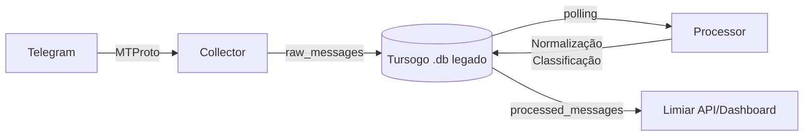

<div align="center">
  <h1>🚀 Limiar</h1>
  <p><strong>Pipeline de Monitoramento e Processamento de Promoções do Telegram</strong></p>
  <p>
    <a href="#o-que-é">O que é</a> •
    <a href="#como-funciona">Como Funciona</a> •
    <a href="#início-rápido">Início rápido</a> •
    <a href="#comandos-da-cli">CLI</a> •
    <a href="#configuração">Configuração</a> •
    <a href="#regras-do-projeto">⚠️ Regras do Projeto</a>
  </p>
</div>

---

O **Limiar** transforma o ruído dos canais de ofertas do Telegram em dados estruturados. Canais promocionais são uma excelente fonte de ofertas, mas sofrem com duplicidade, formatos de texto bagunçados e falta de estruturação.

O Limiar resolve isso através de um **Pipeline de Dados** construído em **Go** (Golang), que se conecta nativamente ao Telegram usando a tecnologia de _userbot_ (MTProto), monitora seus canais favoritos, extrai os links/preços/cupons e os disponibiliza em tempo real.

> [!NOTE]
> A implementação legada atual das Fases 1 (Coleta) e 2 (Processamento) ainda roda no orquestrador unificado (`limiar run`) sobre o banco local Tursogo (`limiar.db`). A Rebaseline 2026 já aceitou, pelo ADR 019, um **novo storage SQLite side-by-side com `github.com/ncruces/go-sqlite3`**. Essa arquitetura está sendo implementada por slices; o banco legado não é migrado in-place e continua preservado enquanto importação/rollback dependerem dele.

## 🛠 Como Funciona

O diagrama abaixo descreve a **implementação legada atualmente executável**, não a forma final do novo storage da Rebaseline:



1. **Collector:** Autentica como um usuário (não bot), faz download de mensagens antigas (backfill) e fica escutando em tempo real (livestream). Na implementação atual, persiste payloads no banco legado; na Rebaseline, Evidence admitida é append-only/versionada conforme ADR 016.
2. **Processor:** Na implementação atual, pega os payloads brutos, extrai URLs, detecta preços e cupons, categoriza se a promoção acabou, deduplica produtos iguais em canais diferentes, e gera os *processed_messages*.
3. **API & Dashboard:** Entrega os dados formatados (REST) e atualizações ao vivo (Server-Sent Events) para que o *Limiar Frontend* mostre a mágica acontecendo.

## ⚡ Início rápido

O Limiar não requer instalações complexas. Apenas o Go (versão 1.22+) instalado na máquina.

```bash
# 1. Compile o projeto
go build -o limiar ./cmd/limiar-collector

# 2. Defina suas credenciais do Telegram (AppID e APIHash)
export LIMIAR_APP_ID="123456"
export LIMIAR_API_HASH="sua_hash_secreta"

# 3. Faça o login pela primeira vez (interativo)
./limiar auth

# 4. Adicione um canal para monitorar
./limiar channels add "nome_do_canal"

# 5. Rode o orquestrador! (Collector + Processor + Dashboard)
./limiar run
```

## 💻 Comandos da CLI

O executável possui uma suíte de comandos interativos para gerenciamento:

- **`limiar auth`**: Realiza o login (pede telefone, código via SMS/App e senha 2FA). Só precisa rodar uma vez.
- **`limiar channels list`**: Lista quais canais estão sendo observados.
- **`limiar channels add <username>`**: Passa a escutar aquele canal.
- **`limiar channels remove <username>`**: Deixa de observar.
- **`limiar run`**: É onde a magia acontece. Inicia as goroutines do pipeline e expõe os endpoints HTTP e métricas.

## ⚙️ Configuração

Você pode usar variáveis de ambiente ou colocar um arquivo `.env` na raiz do projeto.

| Variável | Descrição | Padrão |
|----------|-----------|---------|
| `LIMIAR_APP_ID` | Telegram API ID (Obrigatório) | - |
| `LIMIAR_API_HASH` | Telegram API Hash (Obrigatório) | - |
| `LIMIAR_DB_PATH` | Caminho para o banco local legado atual | `./limiar.db` |
| `LIMIAR_LOG_LEVEL` | Verbosiade do log (`debug`, `info`, `warn`, `error`) | `info` |
| `LIMIAR_LOG_FORMAT` | Estilo do Log (`pretty`, `json`, `text`) | `pretty` |

> [!TIP]
> Para desenvolvimento local, recomendamos usar `LIMIAR_LOG_FORMAT=pretty` para ver as mensagens chegarem coloridas no terminal com emojis indicativos!

## ⚠️ Regras do Projeto (Para Contribuidores e IAs)

> [!CAUTION]
> Este repositório é governado por regras estritas documentadas no [AGENTS.md](AGENTS.md). **A LEITURA É OBRIGATÓRIA ANTES DE QUALQUER COMMIT.**

**Alguns dos invariantes e decisões vigentes:**
- **Evidence antes de progresso:** Evidence exigida deve estar durável antes de `SourceSyncState`/`BackfillProgress` certificar avanço; replay é preferível à perda silenciosa (ADRs 016/017).
- **Storage da Rebaseline:** ADR 019 aceita `github.com/ncruces/go-sqlite3` como baseline do novo banco SQLite, com `WAL`, `synchronous=FULL`, migrations SQL versionadas e banco novo side-by-side. Tursogo continua somente onde o legado/importação ainda exigir.
- **Sem ORM por conveniência:** O ADR 019 rejeita adicionar ORM sem necessidade demonstrada; dependências estruturais seguem a autoridade de ADRs aceitos, não listas históricas de "closed stack".
- **Evidence não é `raw_messages`:** `raw_messages` descreve a implementação legada. A autoridade atual é o contrato de Evidence append-only/versionada do ADR 016; projeções derivadas não substituem a observação admitida.

Consulte `AGENTS.md`, `docs/BASELINE.md` e `docs/adr/` para a autoridade arquitetural atual. **Atenção à leitura de [`docs/ARCHITECTURE.md`](docs/ARCHITECTURE.md): seu pipeline, esquema Tursogo único, fan-in DBWriter e descrições de Fases 1/2 documentam o legado; não são autorização para reproduzir essa arquitetura como alvo da Rebaseline.** Havendo divergência, prevalecem `AGENTS.md` e ADRs `Accepted`; `docs/BASELINE.md` resume as decisões vigentes sem substituir os ADRs. Contratos ainda `Proposed` não autorizam implementação produtiva.
